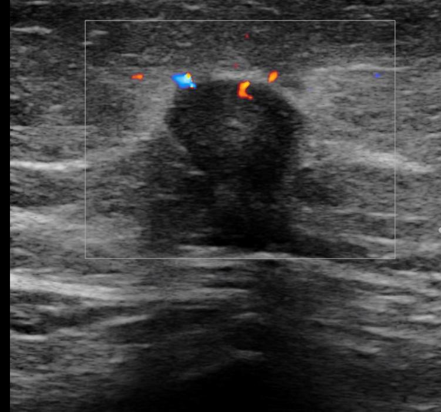
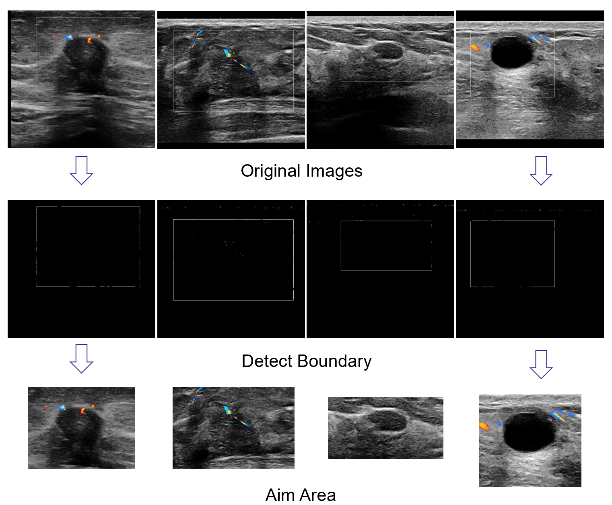

# Detect-Rectangle-Mark-in-Medical-Images
Detect  white rectangle mark in medical images, using morphological opening and Hough transform.

### TODO：
* chinese version of readme
* background
* method 1 & 2 with theory and result
* upload codes

## Content
    * [background](#background)

## Background

<!-- 医学图像中常常有医生标记的感兴趣的区域。一般而言，在建立深度学习模型之前，需要手动将这些区域选出。这个项目提出一种基于图形学方法来选择这些区域。 -->
Medical images often have regions of interest marked by doctors. Generally speaking, before building a deep learning model, we need to manually select these areas, which is time-consuming and needs to be patient. This repo proposes a graphics-based method to select these areas automatically.

Take ultrasound(US) images for example. .....

## Method 1

todo:
rgb2gray -> imopen -> imsubtract -> hough...

